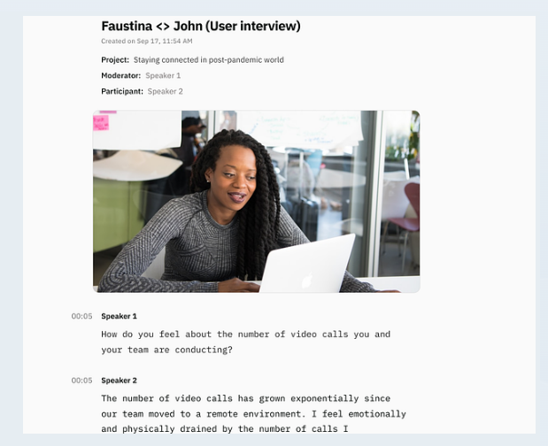

# An assignment - to imitate a podcast image's screenshot

This task is part of the Women Techsters Program and involves replicating a live preview screenshot of a podcast webpage. Below is the screenshot I recreated.

## Built With

* HTML - The markup language used to structure the webpage
* CSS - Cascading Style sheets used to style the webpage

## Contributing

Pull requests are welcome. For major changes, please open an issue first
to discuss what you would like to change.

Please make sure to update tests as appropriate.

## License

[MIT](https://choosealicense.com/licenses/mit/)